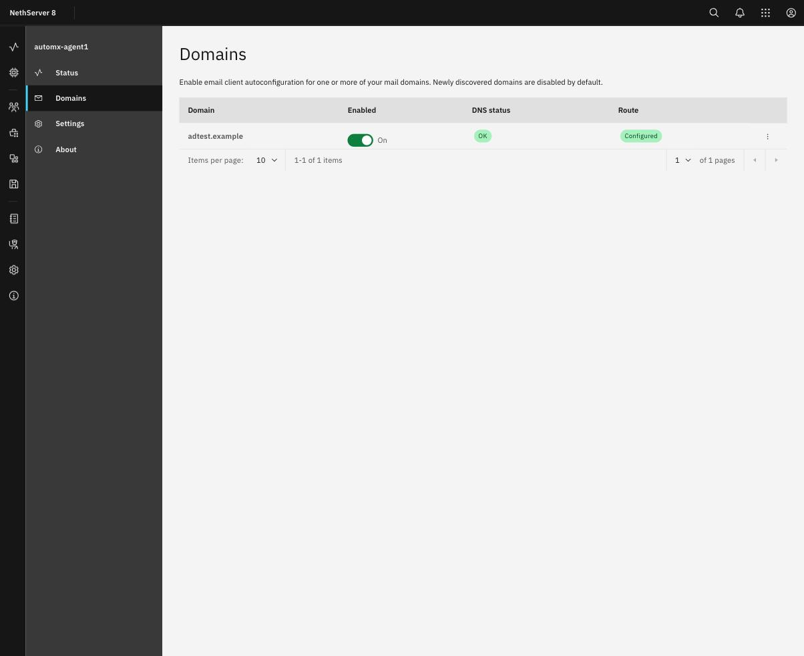
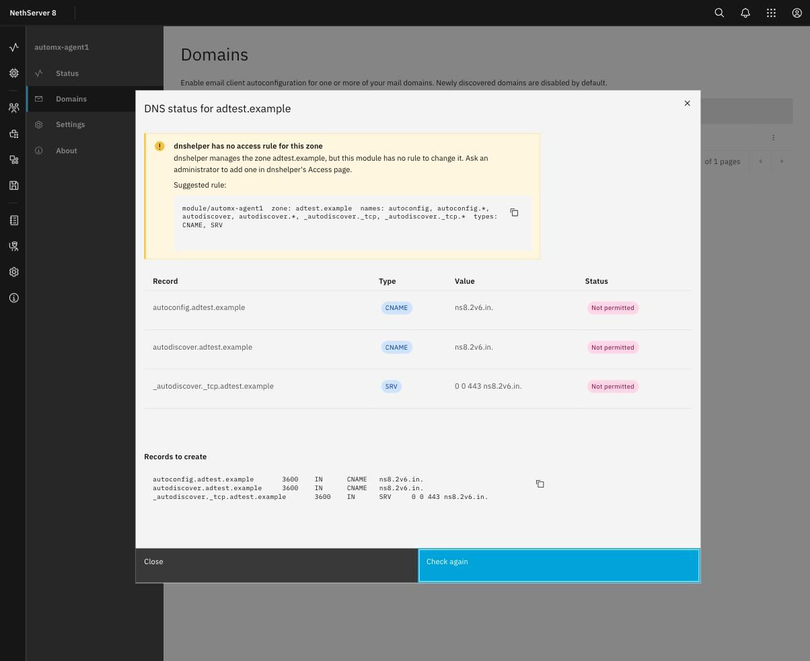
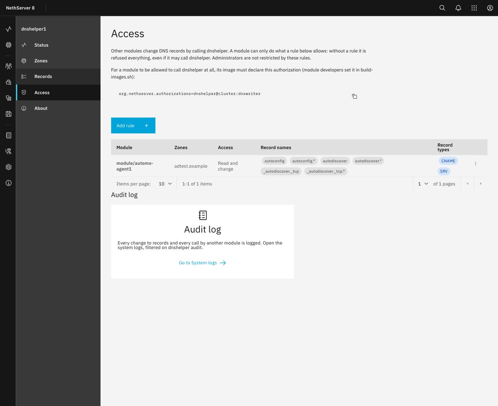
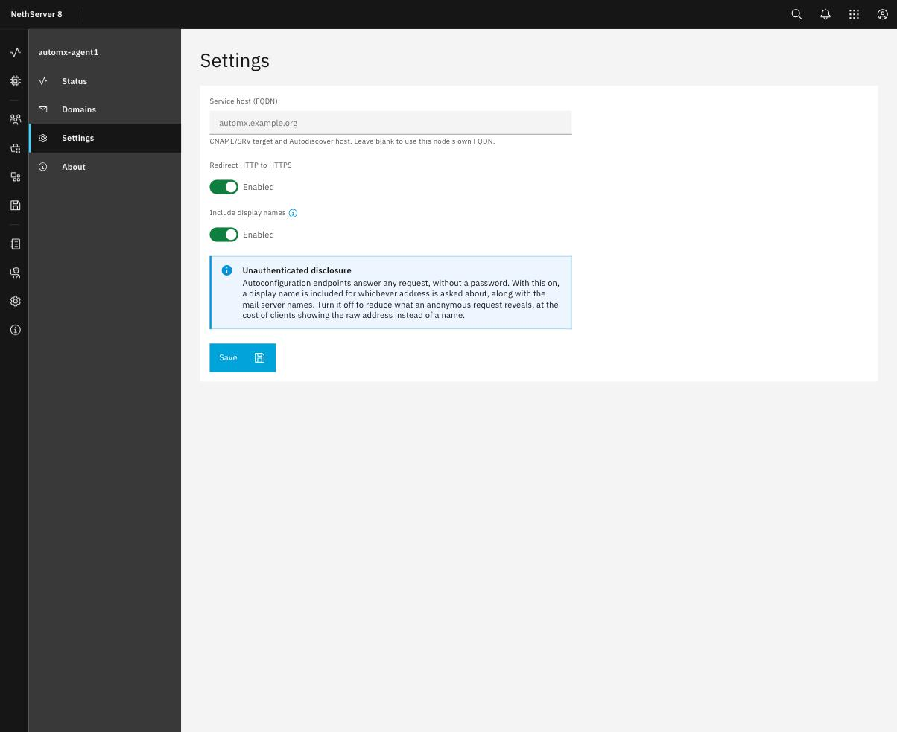
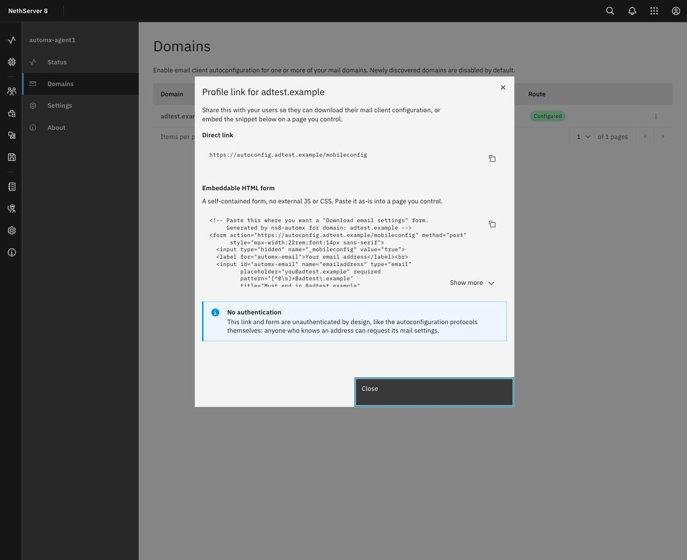
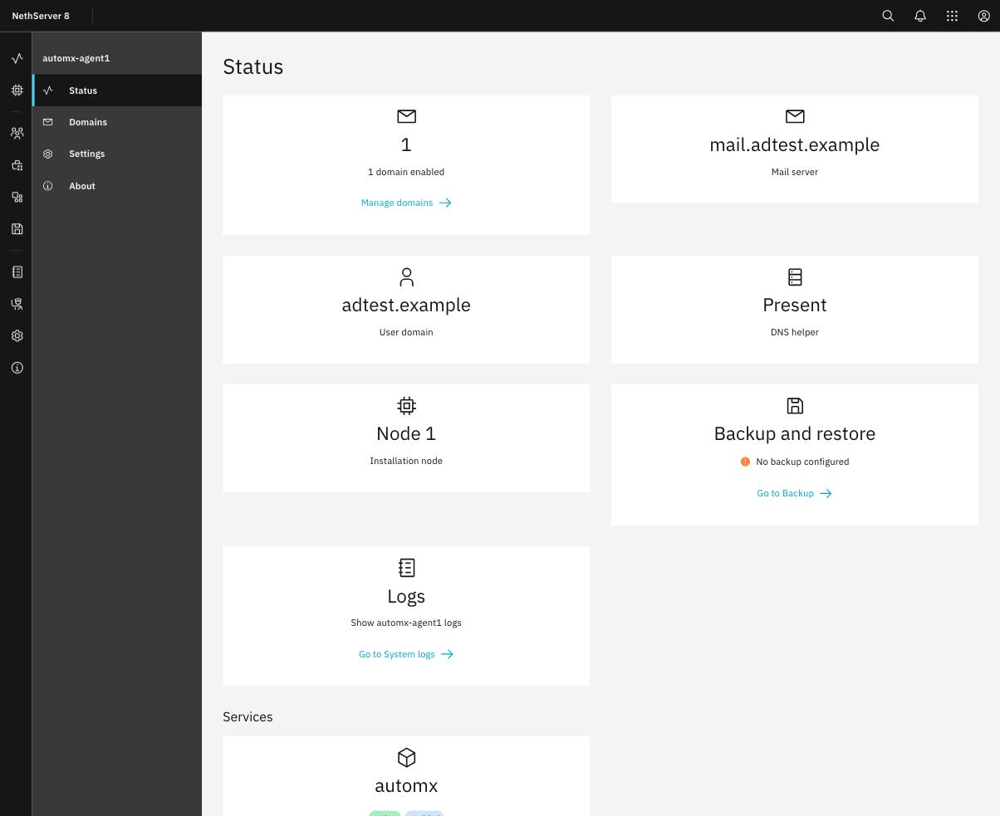

# automx user guide

This guide is for the person who administers an NS8 node. It explains what automx does,
what it needs before it can do anything, how to enable a domain and publish the DNS
records clients need to find it, how to let [dnshelper](https://github.com/danb35/ns8-dnshelper)
manage those records for you (optional), and how to share a download link with your
users. Developers who want to know how it's built, or how it uses dnshelper and the mail
module, should read the [main README](../README.md) instead.

- [What automx does](#what-automx-does)
- [Before you start](#before-you-start)
- [Enabling a domain](#enabling-a-domain)
- [Publishing the DNS records](#publishing-the-dns-records)
- [Optional: managing DNS through dnshelper](#optional-managing-dns-through-dnshelper)
- [Settings](#settings)
- [Sharing a download link with your users](#sharing-a-download-link-with-your-users)
- [Checking on things: the Status page](#checking-on-things-the-status-page)
- [Backup and restore](#backup-and-restore)
- [When something goes wrong](#when-something-goes-wrong)

## What automx does

When someone sets up a new email account, most mail clients ask for nothing but an email
address and a password. Thunderbird, Outlook and Apple Mail all then try to *discover*
the rest — the mail server's host name, its ports, whether to use SSL — by asking a
handful of well-known DNS names and web addresses derived from the domain in the address.
automx answers those requests for your NS8 mail domains, so your users never have to be
told a server name, a port number or an encryption setting by hand.

It also looks up the address in your accounts directory (OpenLDAP or Samba AD, whichever
your mail domain's user domain uses) so the client is told the person's real login name
and display name, not just the address they typed. A user's own address
(`dan@example.com`) works for this out of the box. An address that is only a mail
*alias* is not resolved to a login in this version: a client asking about an alias gets a
generic answer and the person may need to enter their username by hand. See
[When something goes wrong](#when-something-goes-wrong).

The pages of the application, in the side menu:

| Page | What it is for |
|---|---|
| **Status** | How many domains are enabled, which mail server and user domain are in use, whether dnshelper is present, service health, backup status and a shortcut to the logs |
| **Domains** | Turn autoconfiguration on or off per mail domain, see its DNS and route status, publish DNS records, get a profile download link |
| **Settings** | The service host name, whether HTTP redirects to HTTPS, and whether display names are included in responses |
| **About** | Version and links |

Nothing here requires you to touch DNS or the mail server directly: automx reads your
mail domains from the mail module and only ever *adds* the three DNS records each
enabled domain needs.

## Before you start

You need a **mail module instance already configured**, with at least one mail domain
and an accounts provider (OpenLDAP or Samba AD) bound to it as its user domain. automx
has nothing to offer until the mail module has both.

You do **not** need dnshelper. Without it, automx tells you exactly which DNS records to
create and lets you check whether they've shown up; with it, automx can create and fix
them for you, after you review and confirm each change. See
[Publishing the DNS records](#publishing-the-dns-records) for both paths.

## Enabling a domain

Open **Domains**. It lists every mail domain the mail module knows about. New domains
start **disabled** — nothing is published for a domain until you turn it on.

Turning a domain on:

1. Reads the mail domain's user domain and looks up your directory's connection details.
2. Renders and validates automx's own configuration, and starts (or reloads) its
   service.
3. If `autoconfig.<domain>` and `autodiscover.<domain>` already resolve to this node,
   creates their Traefik routes right away, with a Let's Encrypt certificate.

If those two host names don't resolve yet — the usual case the first time you enable a
domain, before its DNS records exist — automx deliberately does **not** create the route
yet, and the Domains page shows the domain as **waiting for DNS** instead. This is by
design, not a glitch to wait out: a route created before its DNS is ready gets exactly one
shot at a certificate from Let's Encrypt, and a route stuck like that can stay
uncertified for a long time (Let's Encrypt's own rate limits) even after the DNS is fixed
soon after. So automx holds off instead.

Nothing extra to do once DNS is in place, though — publish the records (see the next
section) and automx creates the route and certificate automatically the next time it
checks. Opening the domain's DNS status dialog, pressing **Check again** there, or
confirming **Create missing records** (with dnshelper) all trigger that check on their
own, so publishing the records is the last step, not a separate "now go create the route"
one.

A domain that later disappears from the mail module (its mail domain was removed) is
marked **Orphaned**: automx keeps remembering whether it was enabled, but there's nothing
left to serve, so its toggle is greyed out until an administrator deals with it on the
mail module's side.

Disabling a domain removes its route immediately. Its DNS records are left in place —
clients that already cached them would otherwise start failing — unless you explicitly
ask to remove them too, from the same dialog you use to publish them (see below).

## Publishing the DNS records

Each enabled domain needs three DNS records to work everywhere:

| Name | Type | Points at |
|---|---|---|
| `autoconfig.<domain>` | CNAME | This node's own name (or the service host you set in Settings) |
| `autodiscover.<domain>` | CNAME | The same |
| `_autodiscover._tcp.<domain>` | SRV | The same, on port 443 |

Open the row's overflow menu (⋮) and choose **DNS status**. What you see there depends
on whether dnshelper is installed and covers the domain's zone:

**Without dnshelper**, or if dnshelper doesn't manage this particular zone, you get an
info banner saying so and a copyable list of the exact records to create — name, type,
value — for your own DNS provider's control panel. Create them there, then use **Check
again** in the same dialog once you have.

**With dnshelper covering the zone**, the dialog instead shows each record's live status
— *OK*, *Missing*, *Conflict* — and offers buttons to act on them:

- **Create missing records** appends whatever is missing.
- **Overwrite conflicting records** replaces a record that already exists with a
  different value, or — if something of a *different* type is in the way (an A record
  where a CNAME is needed) — removes it first and then adds the CNAME.

Either button first shows you a preview of exactly what will change (nothing is done
until you confirm), then you press **Confirm** to apply it for real.

If dnshelper manages the zone but has no access rule letting this module change it yet,
the dialog says so directly and shows the exact rule to add — see the next section.

Disabling a domain offers to remove its DNS records too, using the same dnshelper
connection, matching the exact name, type and value automx created — so anything else at
that name is left untouched.

## Optional: managing DNS through dnshelper

This step is entirely optional. Without it, automx still works — you just create the DNS
records yourself, once, following the copyable list on the Domains page. With
[dnshelper](https://github.com/danb35/ns8-dnshelper) installed and given access, automx
can create, check and fix those same records for you from its own Domains page, with a
preview before every change.

**1. Install dnshelper**, if it isn't already (it's in the same Software center repository
as automx; see the [README](../README.md#install)), and add a zone covering your mail
domain(s) on its own Zones page. See dnshelper's own
[user guide](https://github.com/danb35/ns8-dnshelper/blob/master/docs/USER-GUIDE.md) for
that part — it needs an API credential from whichever service hosts your DNS.

**2. Grant automx access.** dnshelper starts every module, including this one, with **no
access at all** — a rule has to be added before automx can change (or even read) a
single record, on purpose, so a bug or a misconfigured module can only ever touch what
you explicitly allowed. Until you do, automx's own DNS status dialog says so directly and
shows the exact rule to add, with the real zone name already filled in:

Open dnshelper's **Access** page and add a rule with these values (or use `set-policy`
with the same fields):

| Field | Value |
|---|---|
| **Module** | `module/automx1` (or whatever your automx instance is actually called — check the Status page if you're not sure) |
| **Zones** | The zone(s) covering your mail domains, or **All zones** |
| **Access** | *Read and change* |
| **Record names** | `autoconfig`, `autoconfig.*`, `autodiscover`, `autodiscover.*`, `_autodiscover._tcp`, `_autodiscover._tcp.*` |
| **Record types** | `CNAME, SRV` |

That covers creating the three records, and replacing one whose value is wrong. If you
also want automx able to **overwrite a record of a different type** that's sitting where
a CNAME needs to go (for example, deleting a stray A record at `autoconfig.<domain>`
before adding the CNAME), the rule additionally needs to allow that conflicting type at
the same names — add it (`A`, in that example) or set **Record types** to `*`.

**3. That's it** — no further step is needed on automx's side. Its Domains page rechecks
dnshelper's coverage and your access rule live, every time you open the DNS status
dialog: if you add the zone or the rule *after* a domain was already enabled here, automx
notices on its own next check, with nothing to toggle or re-save.

If you ever remove dnshelper, or the access rule, automx falls back to showing the
manual copyable instructions again — the records it already created are left alone
either way, since removing dnshelper's access doesn't touch anything already published.

## Settings

Open **Settings**.

- **Service host (FQDN)** — the name the CNAME and SRV records point at, and the host
  Outlook's Autodiscover route is published on. Leave it blank to use this node's own
  name, which is right for almost everyone; only set it if you want autoconfiguration to
  point somewhere other than this specific node (for example, a load balancer in front of
  several nodes).
- **Redirect HTTP to HTTPS** — on by default. Thunderbird and most current clients try
  HTTPS first anyway; leave this on unless you have a specific reason to serve plain
  HTTP.
- **Include display names** — on by default. automx looks up the display name for
  whichever address a client asks about and includes it in the response, which is
  normal, expected client behavior. Since these endpoints answer *any* request without a
  password, by protocol design, this is also a small amount of address-to-name
  disclosure to anyone who asks. Turn it off if you'd rather trade that away for clients
  showing the raw email address instead of a name.

## Sharing a download link with your users

automx's own endpoints don't need a password — that's how autoconfiguration protocols
work, a client only ever supplies the address it's setting up — so there's no separate
sign-in page inside this module for your users. Instead, once a domain is enabled, its
row's overflow menu offers **Get profile link**, giving you two things to hand to your
users however you already reach them (an intranet page, a wiki, a welcome email):

- **A direct link** (`https://autoconfig.<domain>/mobileconfig`) to automx's own small
  download page: a user types their address, downloads their mail profile. Nothing to
  build; just share the link.
- **An embeddable HTML form**, a self-contained snippet with no external JavaScript or
  CSS, for pasting into a page you control if you'd rather users didn't have to leave it.

Both are a thin wrapper around the same already-public, unauthenticated URL — they add
no authentication of their own, just convenience.

## Checking on things: the Status page

**Status** shows how many domains are enabled with a shortcut to manage them, the mail
server and user domain currently in use, whether dnshelper is present, the automx
service's own health, your backup status, and a card that opens this module's system
logs.

If a domain looks wrong, start here: the service cards show whether the automx
service is actually running, which is the first thing to check if enabling a domain
succeeded but a client still can't find it.

## Backup and restore

automx's backup includes each domain's enabled/disabled flag and the module's settings
(service host, HTTP-to-HTTPS default, display-names toggle). It does **not** include the
rendered configuration file that's actually served — that file contains your directory's
bind password, and it's regenerated automatically from your mail module and accounts
provider every time the service starts, so there's nothing useful to preserve there
between backups.

After a restore, automx re-creates its Traefik routes and re-renders its configuration
on its own; you don't need to re-enable domains or re-check anything. If dnshelper
managed the zone before, you'll need to re-add the access rule for the *restored*
module's own id if it changed — the DNS status dialog will tell you exactly what's
missing, the same as it would for a domain enabled for the first time.

## When something goes wrong

| What you see | What it means and what to do |
|---|---|
| A domain stays **Waiting for DNS** | Its `autoconfig`/`autodiscover` names don't resolve to this node yet, so automx has deliberately held off creating its route rather than let it fail its one shot at a certificate. Publish the records (see [Publishing the DNS records](#publishing-the-dns-records)) — the route and certificate are created automatically the next time automx checks, which opening the DNS status dialog or pressing **Check again** both do |
| **DNS is not managed by dnshelper for this domain** | Either dnshelper isn't installed, or it's installed but the zone covering this domain isn't one of its zones. Follow the copyable instructions shown, or add the zone on dnshelper's own Zones page |
| **dnshelper has no access rule for this zone** | dnshelper knows the zone, but this automx instance hasn't been given a rule for it yet. Add the rule shown in the dialog — see [Optional: managing DNS through dnshelper](#optional-managing-dns-through-dnshelper) |
| A DNS record shows **Conflict** | Something else already exists at that name with a different value (or a different record type). Use **Overwrite conflicting records** if dnshelper manages the zone, after reviewing the preview, or fix it at your DNS provider directly otherwise |
| A client shows the person's raw email address instead of their name | Either **Include display names** is off in Settings, or the address the client asked about is a mail *alias* rather than the person's actual login — aliases are not resolved to a directory entry in this version, so the client falls back to a generic answer and may need the real login entered by hand |
| A domain is greyed out and marked **Orphaned** | The mail domain it was for no longer exists on the mail module. Nothing is being served for it; remove it from the mail module for good if it's not coming back |
| The service on the Status page shows as not running | Check the service logs from the Status page's Logs card. A validation failure in the rendered configuration (for example, the accounts provider being briefly unreachable) leaves the *previous* working configuration in place rather than taking the service down, so this usually means something more fundamental — the mail module or the accounts provider being absent entirely |

If something still doesn't work, the Status page's Logs card shows what automx itself
logged. Please report bugs at <https://github.com/danb35/ns8-automx/issues>; do not
include passwords or bind credentials.
